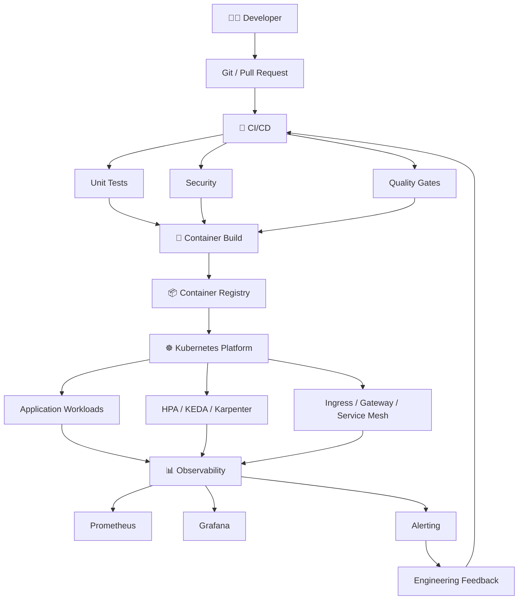
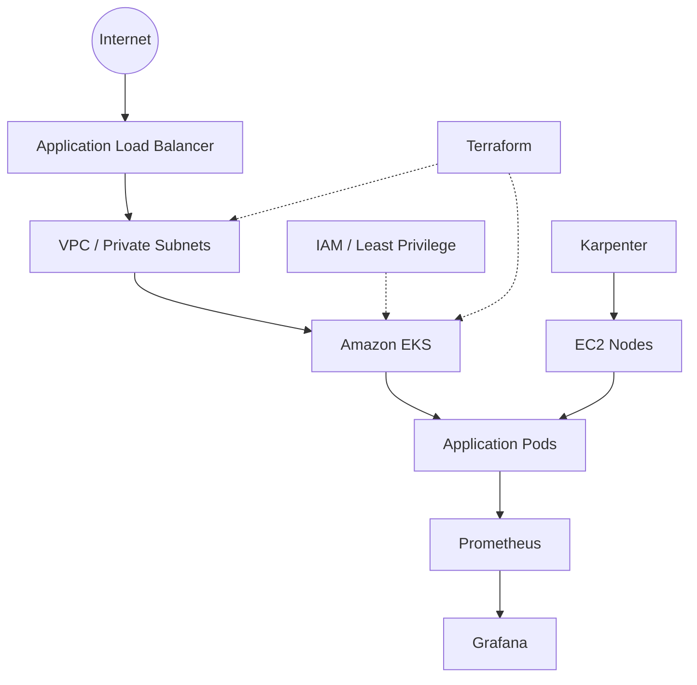
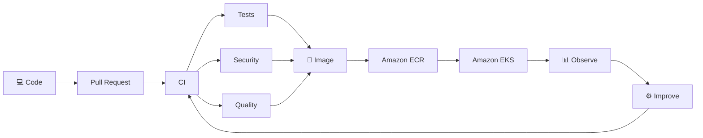
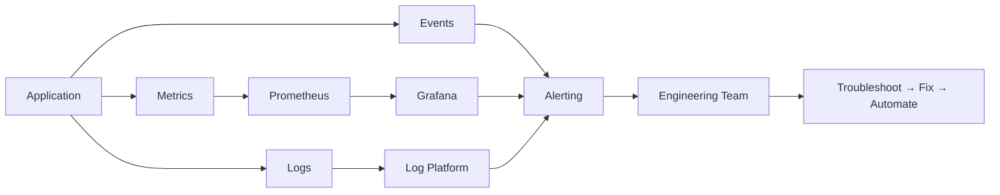
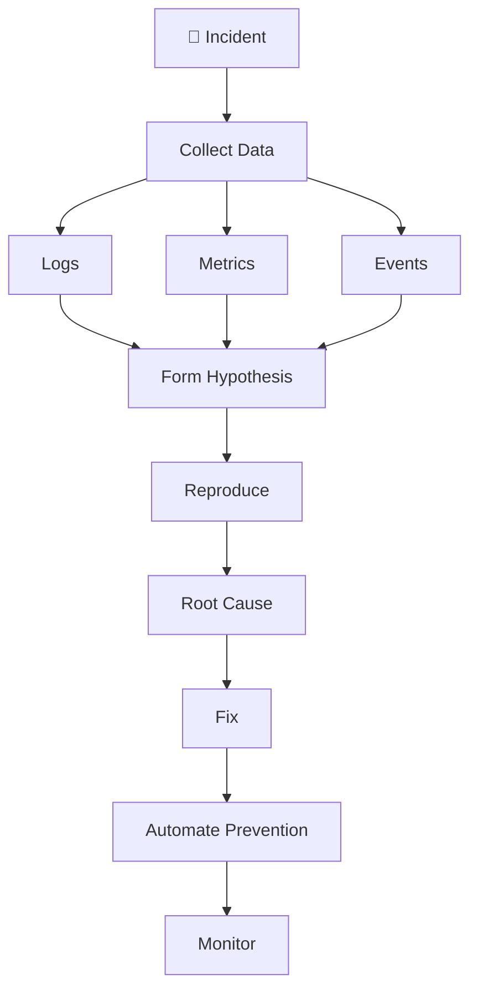
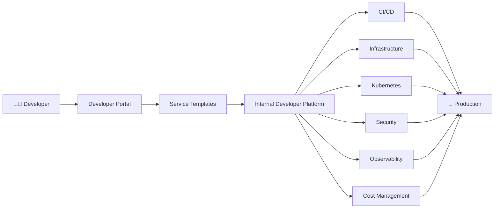

<div align="center">

<a href="https://github.com/ramdrazler1">
  
</a>

<br/>


<br/><br/>

<a href="https://github.com/ramdrazler1">

</a>
<a href="https://aws.amazon.com/">

</a>
<a href="https://kubernetes.io/">

</a>
<a href="https://www.jenkins.io/">

</a>
<a href="https://www.terraform.io/">

</a>

</div>

---

## ⚡ Engineering at a Glance

<div align="center">

<table>
<tr>
<td align="center" width="20%"><b>☁️ CLOUD</b><br/><sub>AWS · EKS · EC2 · VPC · IAM</sub></td>
<td align="center" width="20%"><b>🚀 DELIVERY</b><br/><sub>Jenkins · GitHub Actions</sub></td>
<td align="center" width="20%"><b>☸️ PLATFORM</b><br/><sub>Kubernetes · Helm · KEDA</sub></td>
<td align="center" width="20%"><b>🏗️ IaC</b><br/><sub>Terraform · Terragrunt · Ansible</sub></td>
<td align="center" width="20%"><b>📊 SRE</b><br/><sub>Prometheus · Grafana · Alerting</sub></td>
</tr>
</table>

</div>

---

# 👨‍💻 About Me

I'm a **DevOps Engineer focused on cloud infrastructure, CI/CD engineering, Kubernetes platforms, infrastructure automation, and production reliability**.

I design systems around a simple principle:

> **Developers should have a paved road from code to production, while infrastructure teams retain control over security, reliability, scalability, and cost.**

### What I care about

- ⚡ Faster and safer software delivery
- ☁️ Scalable AWS infrastructure
- ☸️ Production-grade Kubernetes platforms
- 🔄 Reproducible Infrastructure as Code
- 🔐 Security throughout the delivery lifecycle
- 📊 Observable systems and actionable alerting
- 💰 Continuous cloud cost optimization
- 🤖 Automation of repetitive operational work
- 🧩 Internal Developer Platforms

---

# 🌌 The Platform I Engineer

<div align="center">


</div>

> If the custom architecture image is not available in the repository, the section below provides the same architecture in Markdown.

<div align="center">



</div>

---

# 🔄 DevOps Automation Loop

<div align="center">


</div>

---

# ☁️ AWS Cloud Engineering

<table>
<tr>
<td width="50%" valign="top">

### Infrastructure

- EC2
- VPC
- Private Subnets
- ALB
- Route 53
- IAM
- Security Groups

</td>
<td width="50%" valign="top">

### Containers & Delivery

- Amazon EKS
- Amazon ECR
- Jenkins
- GitHub Actions
- Docker
- Terraform

</td>
</tr>
</table>

### AWS Architecture

<div align="center">



</div>

---

# ☸️ Kubernetes Platform Engineering

<div align="center">

<table>
<tr>
<td width="33%" align="center">

### 🧩 Workloads

Deployments  
StatefulSets  
Jobs  
CronJobs  
ConfigMaps  
Secrets

</td>
<td width="33%" align="center">

### 🌐 Networking

Services  
Ingress  
Gateway API  
HTTPRoute  
Istio  
Load Balancing

</td>
<td width="33%" align="center">

### 📈 Scaling

HPA  
KEDA  
Karpenter  
Resource Policies  
Node Provisioning  
Capacity Planning

</td>
</tr>
</table>

</div>

### Kubernetes Operating Model

```text
APPLICATION
    │
    ├── Deployment / StatefulSet / Job
    │
    ▼
SERVICE
    │
    ├── Service / Ingress / Gateway API
    │
    ▼
SCALING
    │
    ├── HPA → Pod capacity
    ├── KEDA → Event-driven capacity
    └── Karpenter → Node capacity
    │
    ▼
OBSERVABILITY
    │
    ├── Metrics
    ├── Logs
    ├── Events
    └── Alerts
```

---

# 🚀 CI/CD Engineering

### Jenkins

**Jenkins + Groovy + Shared Libraries + Multibranch + Remote Jenkinsfiles**

- Declarative and scripted pipelines
- Dynamic build agents
- Pipeline approvals
- Lockable resources
- Timeouts
- Docker builds
- ECR integration
- Artifact publishing
- Slack notifications
- Deployment workflows
- Pipeline troubleshooting

### GitHub Actions

**PR validation + Unit Tests + Coverage + Quality Gates**

- Self-hosted runners
- Changed-application workflows
- Unit-test automation
- Coverage reporting
- Artifact publishing
- Branch-based workflows
- Required PR checks
- Merge protection

### Delivery Pipeline

<div align="center">



</div>

---

# 🐳 Container Engineering

| Area | Focus |
|---|---|
| Dockerfiles | Optimization and maintainability |
| BuildKit | Efficient builds |
| Multi-stage builds | Smaller production images |
| Private dependencies | Secure package access |
| SSH authentication | Secure build-time access |
| Environment management | Build vs runtime separation |
| Registry | ECR / artifact workflows |
| Runtime | Kubernetes container operations |

---

# 🏗️ Infrastructure as Code

<div align="center">

<table>
<tr>
<td align="center" width="33%">

### Terraform

AWS infrastructure  
EKS  
EC2  
IAM  
Networking  
Reusable modules

</td>
<td align="center" width="33%">

### Terragrunt

DRY configuration  
Environment separation  
Remote state  
Multi-environment orchestration

</td>
<td align="center" width="33%">

### Ansible

Server configuration  
Packages  
Application setup  
Operational automation

</td>
</tr>
</table>

</div>

> **Version Controlled → Reviewable → Reproducible → Automated → Auditable**

---

# 📊 Observability & Reliability

<div align="center">



</div>

### Observability Questions

> **What failed?**  
> **When did it fail?**  
> **What changed?**  
> **Why did it fail?**  
> **Is it recovering?**  
> **How do we prevent it from happening again?**

---

# 🔐 DevSecOps

Security is designed into the delivery path.

<div align="center">

**SOURCE** → **PR** → **TEST** → **QUALITY** → **SECURITY** → **BUILD** → **REGISTRY** → **KUBERNETES** → **MONITOR**

</div>

### Security Focus

- IAM
- Least privilege
- Secret handling
- Secure CI/CD
- Container security
- Dependency security
- Registry authentication
- SSH authentication
- Security gates
- Secure infrastructure

---

# 🧠 Engineering Principles

<table>
<tr>
<td width="50%" valign="top">

### 01 — Automate First
If a task is repeated, automate it.

### 02 — Infrastructure as Code
Infrastructure belongs in version control.

### 03 — Security by Default
Security is part of engineering, not a final checklist.

### 04 — Observable by Design
Systems should explain what happened.

</td>
<td width="50%" valign="top">

### 05 — Design for Failure
Assume components will fail.

### 06 — Scale Automatically
Scale workloads and infrastructure with demand.

### 07 — Optimize Continuously
Improve reliability, performance, developer experience and cost.

</td>
</tr>
</table>

---

# 🧪 Troubleshooting Philosophy

<div align="center">



</div>

> **Don't just fix the incident. Fix the system that allowed the incident to happen.**

---

# 🧩 Technology Matrix

<div align="center">

| Domain | Technologies |
|---|---|
| ☁️ Cloud | AWS · EKS · EC2 · VPC · ALB · ECR · IAM |
| ☸️ Kubernetes | Kubernetes · Helm · HPA · KEDA · Karpenter · Istio · Gateway API |
| 🚀 CI/CD | Jenkins · Groovy · GitHub Actions · Docker · Nexus |
| 🏗️ IaC | Terraform · Terragrunt · Ansible |
| 🐧 Systems | Linux · Bash · Git |
| 📊 Observability | Prometheus · Grafana · Alertmanager |
| 🔐 Security | IAM · Least Privilege · Secure CI/CD · Container Security |
| 🧩 Platform | GitOps · Developer Platforms · Automation · Reliability |

</div>

---

# 🛠️ Tech Stack

<div align="center">


</div>

---

# 📂 Featured Projects

<div align="center">

<table>
<tr>
<td width="50%" valign="top">

### 🔥 Jenkins Engineering

<a href="https://github.com/ramdrazler1/lm-jenkins">

</a>

**Groovy · Jenkins · CI/CD**

Pipeline engineering and Jenkins automation experiments.

</td>
<td width="50%" valign="top">

### ☁️ DevOps Portfolio

<a href="https://github.com/ramdrazler1/devops-portfolio">

</a>

**HTML · DevOps**

Personal DevOps portfolio and engineering showcase.

</td>
</tr>

<tr>
<td width="50%" valign="top">

### 🧪 Code Coverage

<a href="https://github.com/ramdrazler1/code-cov">

</a>

**Go · Testing · Coverage**

Automated code coverage experimentation.

</td>
<td width="50%" valign="top">

### 📊 Node.js Coverage

<a href="https://github.com/ramdrazler1/nodejs-coverage">

</a>

**Node.js · JavaScript · Testing**

Node.js testing and coverage implementation.

</td>
</tr>

<tr>
<td width="50%" valign="top">

### 🧪 APM

<a href="https://github.com/ramdrazler1/apm">

</a>

**JavaScript**

Application experimentation and testing.

</td>
<td width="50%" valign="top">

### 🌐 Iqube

<a href="https://github.com/ramdrazler1/Iqube">

</a>

**HTML · CSS**

Web application project.

</td>
</tr>
</table>

</div>

---

# 📈 GitHub Analytics

<div align="center">


<br/><br/>


<br/><br/>


</div>

---

# 🏆 GitHub Achievements

<div align="center">


</div>

---

# 🚀 Current Engineering Focus

<div align="center">

<table>
<tr>
<td width="50%" valign="top">

### ☁️ Cloud

- AWS
- EKS
- Cloud Architecture
- Cost Optimization

### ☸️ Kubernetes

- Cluster Operations
- Karpenter
- KEDA
- HPA
- Gateway API
- Istio

</td>
<td width="50%" valign="top">

### 🚀 CI/CD

- Jenkins
- GitHub Actions
- Shared Libraries
- Self-hosted Runners
- Pipeline Optimization

### 🏗️ Infrastructure

- Terraform
- Terragrunt
- Ansible
- Infrastructure Automation

</td>
</tr>
<tr>
<td width="50%" valign="top">

### 📊 Observability

- Prometheus
- Grafana
- Alerting
- Kubernetes Monitoring

</td>
<td width="50%" valign="top">

### 🧩 Engineering

- Platform Engineering
- DevSecOps
- Reliability
- Automation

</td>
</tr>
</table>

</div>

---

# 🔭 Platform Engineering Direction

<div align="center">



</div>

### The goal

> **Give developers a paved road from code to production without requiring them to become infrastructure experts.**

---

# 🎓 Certifications

> **Add verified certifications here as they are earned.**

| Certification | Provider | Status |
|---|---|---|
| AWS Certified Solutions Architect | AWS | 🔄 Planned / Verify |
| AWS Certified DevOps Engineer | AWS | 🔄 Planned / Verify |
| Certified Kubernetes Administrator | CNCF | 🔄 Planned / Verify |
| Terraform Associate | HashiCorp | 🔄 Planned / Verify |

---

# 🤝 Let's Connect

<div align="center">

**AWS · Kubernetes · DevOps · CI/CD · Terraform · Jenkins · Docker · Platform Engineering · Observability · Cloud Architecture**

<br/><br/>

<a href="https://github.com/ramdrazler1">

</a>

<br/><br/>


</div>

---

<div align="center">

<a href="https://github.com/ramdrazler1">
  
</a>

### ⚡ `AUTOMATE EVERYTHING THAT SHOULD BE AUTOMATED.`

### `OBSERVE EVERYTHING THAT MATTERS.`

### `DESIGN FOR FAILURE.`

<br/>

**🚀 Build → Automate → Secure → Deploy → Observe → Improve**

<br/>

<i>Infrastructure is code. Delivery is automation. Reliability is a feature.</i>

</div>
