<div align="center">

# ⚡ RAMKUMAR

### DEVOPS ENGINEER · CLOUD INFRASTRUCTURE · KUBERNETES · CI/CD · PLATFORM ENGINEERING

**Designing reliable infrastructure. Automating software delivery. Building cloud-native platforms.**

<br/>

<a href="https://github.com/ramdrazler1">
  
</a>
<a href="https://github.com/ramdrazler1?tab=repositories">
  
</a>
<a href="https://aws.amazon.com/">
  
</a>
<a href="https://kubernetes.io/">
  
</a>

<br/><br/>


</div>

---

## 🧭 Engineering Profile

<table>
<tr>
<td width="50%" valign="top">

### ☁️ Cloud Platform

**AWS · EKS · EC2 · VPC · IAM · ALB · ECR**

Designing secure, scalable and cost-conscious cloud infrastructure.

</td>
<td width="50%" valign="top">

### 🏗️ Infrastructure as Code

**Terraform · Terragrunt · Ansible · Bash**

Infrastructure that is version-controlled, reproducible and automated.

</td>
</tr>
<tr>
<td width="50%" valign="top">

### 🚀 CI/CD Engineering

**Jenkins · Groovy · GitHub Actions · Docker · Nexus**

Automated build, test, package, deployment and release workflows.

</td>
<td width="50%" valign="top">

### ☸️ Kubernetes Platform

**EKS · Helm · HPA · KEDA · Karpenter · Istio · Gateway API**

Building platforms that scale workloads and infrastructure automatically.

</td>
</tr>
<tr>
<td width="50%" valign="top">

### 📊 Observability

**Prometheus · Grafana · Alertmanager · Metrics · Logs**

Making production systems measurable, diagnosable and reliable.

</td>
<td width="50%" valign="top">

### 🔐 DevSecOps

**IAM · Least Privilege · Secure CI/CD · Container Security**

Security integrated throughout the software delivery lifecycle.

</td>
</tr>
</table>

---

# 👨‍💻 About Me

I'm a **DevOps Engineer focused on cloud infrastructure, CI/CD engineering, Kubernetes platforms, infrastructure automation, and production reliability**.

My approach goes beyond simply deploying applications. I focus on engineering systems where:

- Developers can ship faster
- Infrastructure is reproducible
- Deployments are automated
- Failures are observable
- Security is integrated into delivery
- Kubernetes workloads scale automatically
- Infrastructure costs are continuously optimized
- Operational tasks are replaced with automation

> **Automate repetitive work. Measure everything important. Secure the delivery path. Design for failure. Fix root causes.**

---

# 🏗️ What I Build

<div align="center">

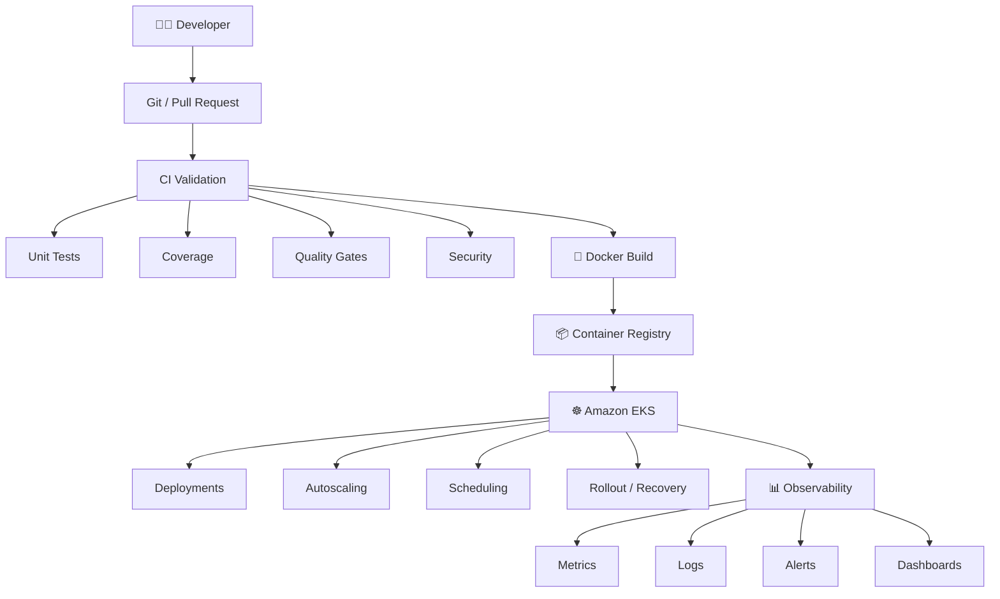

</div>

---

# ☁️ Cloud Architecture

## AWS

My primary cloud focus is **Amazon Web Services**, particularly infrastructure supporting containerized applications and automated delivery.

| Domain | Technologies |
|---|---|
| Compute | EC2 |
| Containers | EKS, ECR |
| Networking | VPC, ALB, Private Subnets |
| Identity | IAM |
| Infrastructure | Terraform |
| DNS | Route 53 |
| Monitoring | CloudWatch |
| Scaling | Auto Scaling, Karpenter |
| Security | IAM, Security Groups, Private Networking |
| Delivery | Jenkins, GitHub Actions, ECR |

### AWS Platform View

<div align="center">

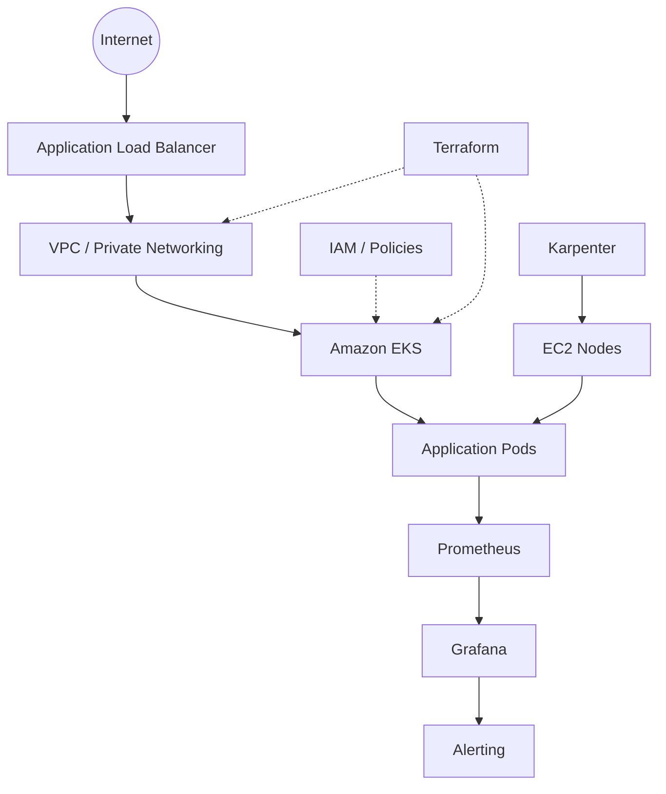

</div>

---

# ☸️ Kubernetes Engineering

I work with Kubernetes from both the **application workload** and **cluster infrastructure** perspectives.

### Kubernetes Stack

<table>
<tr>
<td align="center"><b>APPLICATION</b><br/><br/>Deployments<br/>StatefulSets<br/>Jobs<br/>CronJobs</td>
<td align="center"><b>NETWORKING</b><br/><br/>Services<br/>Ingress<br/>Gateway API<br/>HTTPRoute</td>
<td align="center"><b>SCALING</b><br/><br/>HPA<br/>KEDA<br/>Karpenter</td>
</tr>
<tr>
<td colspan="3" align="center"><br/><b>OBSERVABILITY</b><br/><br/>Prometheus · Grafana · Metrics · Events · Alerting<br/><br/></td>
</tr>
</table>

### Kubernetes Areas

- Amazon EKS
- Kubernetes upgrades
- Deployments and rollouts
- Services and networking
- ConfigMaps and Secrets
- Health probes
- Resource requests and limits
- HPA
- KEDA
- Karpenter
- Helm
- Gateway API
- HTTPRoute
- Ingress
- Cluster add-ons
- Node scheduling
- Pod lifecycle
- Rolling deployments
- Rollbacks
- Troubleshooting
- Capacity planning
- Cost optimization

---

# 📈 Kubernetes Scaling Strategy

A production Kubernetes platform benefits from multiple layers of scaling.

<div align="center">

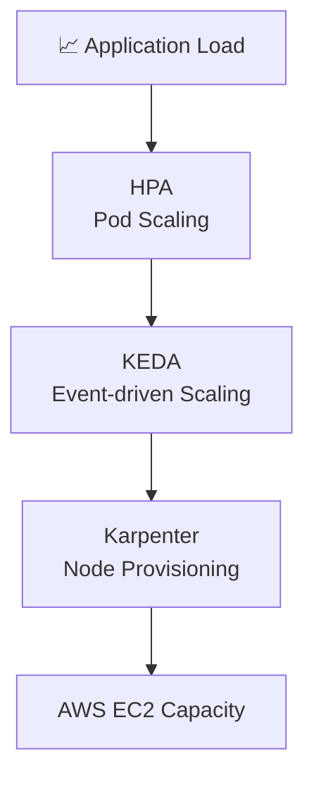

</div>

### Objective

> **Scale workloads when required, provision infrastructure when required, and avoid paying for unnecessary capacity.**

---

# 🚀 CI/CD Architecture

CI/CD is one of my strongest engineering areas.

<div align="center">

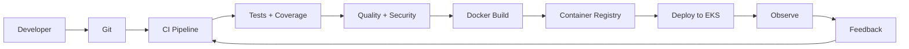

</div>

### Pipeline Capabilities

- Source checkout
- Dependency management
- Unit testing
- Coverage reporting
- Quality gates
- Security validation
- Docker image builds
- Registry publishing
- Kubernetes deployment
- Deployment approvals
- Rollout validation
- Notifications
- Observability

---

# 🔥 Jenkins Engineering

I work extensively with **Jenkins and Groovy-based CI/CD automation**.

### Jenkins Capabilities

| Area | Focus |
|---|---|
| Pipeline | Declarative and scripted pipelines |
| Automation | Groovy and Shared Libraries |
| Source | Multibranch pipelines |
| Jenkinsfiles | Remote Jenkinsfiles |
| Agents | Dynamic / EC2-based agents |
| Controls | Approvals, locks and timeouts |
| Artifacts | Artifact publishing |
| Containers | Docker builds |
| Registry | ECR integration |
| Notifications | Slack |
| Delivery | Automated deployment workflows |
| Operations | Build and pipeline troubleshooting |

### Jenkins Delivery Model

<div align="center">

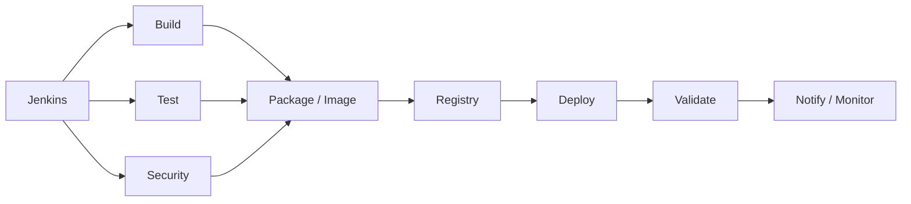

</div>

---

# 🐙 GitHub Actions

I use GitHub Actions for repository-level CI and PR automation.

### Areas

- Pull Request validation
- Unit testing
- Code coverage
- Artifact publishing
- Self-hosted runners
- Branch-based workflows
- Quality gates
- CI automation
- Merge protection

### PR Quality Gate

<div align="center">

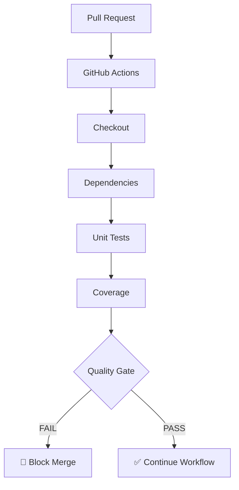

</div>

---

# 🐳 Container Engineering

### Docker Delivery Flow

<div align="center">

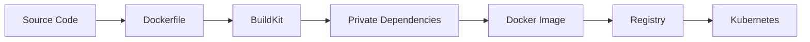

</div>

### Areas of Focus

- Dockerfile optimization
- Multi-stage builds
- BuildKit
- Private package dependencies
- SSH authentication
- Build arguments
- Environment management
- Image size optimization
- Container troubleshooting
- Docker Compose
- Registry authentication
- Runtime configuration

---

# 🏗️ Infrastructure as Code

## Terraform

Infrastructure should be:

<div align="center">

**Version Controlled** → **Reviewable** → **Reproducible** → **Automated** → **Auditable**

</div>

### Terraform Areas

- AWS infrastructure
- EKS
- EC2
- IAM
- Networking
- Security groups
- Load balancers
- EKS add-ons
- Environment management
- Reusable modules

### Terragrunt

- DRY infrastructure
- Environment separation
- Remote state
- Reusable configurations
- Multi-environment deployments

### Ansible

- Server configuration
- Package installation
- Application configuration
- Operational automation
- Environment preparation

---

# 📊 Observability & Reliability

Production systems need visibility.

| Layer | Tools |
|---|---|
| Metrics | Prometheus |
| Visualization | Grafana |
| Alerting | Alertmanager |
| Kubernetes | Metrics / Events |
| Logs | Container / System Logs |
| Infrastructure | AWS Monitoring |
| Application | Custom Metrics |

### Observability Model

<div align="center">

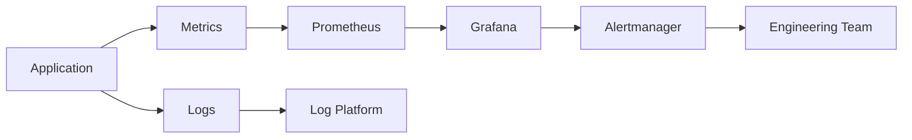

</div>

### Questions Observability Should Answer

> What failed?  
> When did it fail?  
> What changed?  
> Why did it fail?  
> Is the issue application, infrastructure, networking, or dependency related?  
> Is the system recovering?

---

# 🔐 DevSecOps

Security is part of the pipeline — not something added after deployment.

<div align="center">

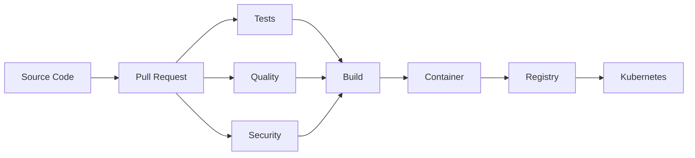

</div>

### Focus Areas

- IAM
- Least privilege
- Secret handling
- Secure CI/CD
- Container security
- Dependency security
- Registry authentication
- SSH-based authentication
- Secure infrastructure
- Security gates

---

# 🧩 Technology Matrix

## ☁️ Cloud

| Technology | Focus |
|---|---|
| AWS | Cloud architecture |
| Amazon EKS | Kubernetes |
| EC2 | Compute |
| VPC | Networking |
| ALB | Load balancing |
| ECR | Container registry |
| IAM | Security |

## ☸️ Kubernetes

| Technology | Focus |
|---|---|
| Kubernetes | Container orchestration |
| EKS | Managed Kubernetes |
| Helm | Packaging |
| HPA | Pod autoscaling |
| KEDA | Event scaling |
| Karpenter | Node provisioning |
| Istio | Service networking |
| Gateway API | Traffic management |

## 🚀 CI/CD

| Technology | Focus |
|---|---|
| Jenkins | Pipeline engineering |
| Groovy | Jenkins automation |
| GitHub Actions | CI automation |
| Docker | Containerization |
| Nexus | Artifact management |
| ECR | Image registry |

## 🏗️ Infrastructure

| Technology | Focus |
|---|---|
| Terraform | Infrastructure as Code |
| Terragrunt | IaC orchestration |
| Ansible | Configuration management |
| Linux | Server administration |
| Bash | Automation |
| Git | Source control |

## 📊 Observability

| Technology | Focus |
|---|---|
| Prometheus | Metrics |
| Grafana | Dashboards |
| Alertmanager | Alerting |
| Kubernetes Metrics | Platform monitoring |

> **The matrix represents areas I actively work with and focus on, rather than formal certification scores.**

---

# 🛠️ Technology Stack

<div align="center">

### Cloud & Infrastructure


### Containers & Kubernetes


### CI/CD & Source Control


### Languages & Automation


### Monitoring


</div>

---

# 📂 Featured Projects

<div align="center">

<table>
<tr>
<td width="50%" valign="top">

### 🔥 Jenkins Engineering

<a href="https://github.com/ramdrazler1/lm-jenkins">

</a>

**Groovy · Jenkins · CI/CD**

Pipeline engineering and Jenkins automation experiments.

</td>
<td width="50%" valign="top">

### ☁️ DevOps Portfolio

<a href="https://github.com/ramdrazler1/devops-portfolio">

</a>

**HTML · DevOps**

Personal DevOps portfolio and engineering showcase.

</td>
</tr>

<tr>
<td width="50%" valign="top">

### 🧪 Code Coverage

<a href="https://github.com/ramdrazler1/code-cov">

</a>

**Go · Testing · Coverage**

Automated code coverage experimentation.

</td>
<td width="50%" valign="top">

### 📊 Node.js Coverage

<a href="https://github.com/ramdrazler1/nodejs-coverage">

</a>

**Node.js · JavaScript · Testing**

Node.js testing and coverage implementation.

</td>
</tr>

<tr>
<td width="50%" valign="top">

### 🧪 APM

<a href="https://github.com/ramdrazler1/apm">

</a>

**JavaScript**

Application experimentation and testing.

</td>
<td width="50%" valign="top">

### 🌐 Iqube

<a href="https://github.com/ramdrazler1/Iqube">

</a>

**HTML · CSS**

Web application project.

</td>
</tr>
</table>

</div>

---

# 🧠 Architecture Principles

<table>
<tr>
<td width="50%" valign="top">

### 01 · Automation First
If a task happens repeatedly, automate it.

### 02 · Infrastructure as Code
Infrastructure should be reproducible and version controlled.

### 03 · Security by Default
Security should be built into the delivery lifecycle.

### 04 · Observable by Design
If a system cannot tell us what happened, it is difficult to operate.

</td>
<td width="50%" valign="top">

### 05 · Design for Failure
Production systems should assume components can fail.

### 06 · Scale Automatically
Applications and infrastructure should scale based on demand.

### 07 · Optimize Continuously
Performance, reliability, developer experience, and cloud cost should continuously improve.

</td>
</tr>
</table>

---

# 🧪 Troubleshooting Philosophy

I enjoy solving complex infrastructure problems.

<div align="center">

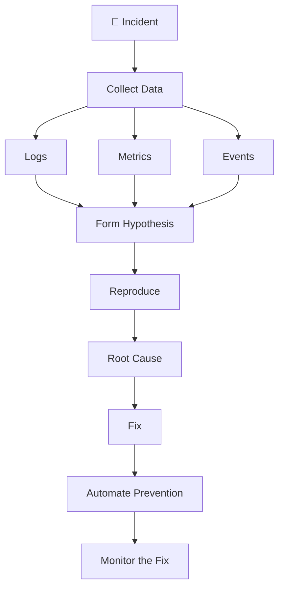

</div>

### I don't just ask:

> "How do I make this work?"

I prefer asking:

> **"Why did this fail, and how do I prevent the same failure from happening again?"**

---

# 🎓 Certifications

## Cloud / DevOps Certifications

> **Add verified certifications here as they are earned.**

| Certification | Provider | Status |
|---|---|---|
| AWS Certified Solutions Architect | AWS | 🔄 Planned / Verify |
| AWS Certified DevOps Engineer | AWS | 🔄 Planned / Verify |
| Certified Kubernetes Administrator | CNCF | 🔄 Planned / Verify |
| Terraform Associate | HashiCorp | 🔄 Planned / Verify |

> Replace the entries above with actual certifications before publishing. Do not claim a certification unless it has been earned.

---

# 📈 GitHub Activity

<div align="center">


<br/><br/>


</div>

---

# 🟩 Contribution Graph

<div align="center">


</div>

---

# 🏆 GitHub Achievements

<div align="center">


</div>

---

# 📊 Engineering Focus

| Area | Focus |
|---|---|
| Cloud Infrastructure | ████████████████████ 100% |
| CI/CD Engineering | ████████████████████ 100% |
| Kubernetes | ███████████████████░ 95% |
| Docker | ███████████████████░ 95% |
| Terraform | ██████████████████░░ 90% |
| Jenkins | ████████████████████ 100% |
| GitHub Actions | ██████████████████░░ 90% |
| Linux | ████████████████████ 100% |
| Observability | █████████████████░░░ 85% |
| Automation | ████████████████████ 100% |
| DevSecOps | ████████████████░░░░ 80% |
| Platform Engineering | ███████████████░░░░░ 75% |

---

# 🚀 Current Engineering Focus

```yaml
current_focus:

  cloud:
    - AWS
    - EKS
    - Cloud Architecture
    - Cost Optimization

  kubernetes:
    - Cluster Operations
    - Karpenter
    - KEDA
    - HPA
    - Gateway API
    - Istio

  cicd:
    - Jenkins
    - GitHub Actions
    - Shared Libraries
    - Self-hosted Runners
    - Pipeline Optimization

  infrastructure:
    - Terraform
    - Terragrunt
    - Ansible
    - Infrastructure Automation

  observability:
    - Prometheus
    - Grafana
    - Alerting
    - Kubernetes Monitoring

  engineering:
    - Platform Engineering
    - DevSecOps
    - Reliability
    - Automation
```

---

# 🔭 What I'm Building Toward

My long-term goal is to move beyond individual pipelines and infrastructure components toward **complete internal developer platforms**.

<div align="center">

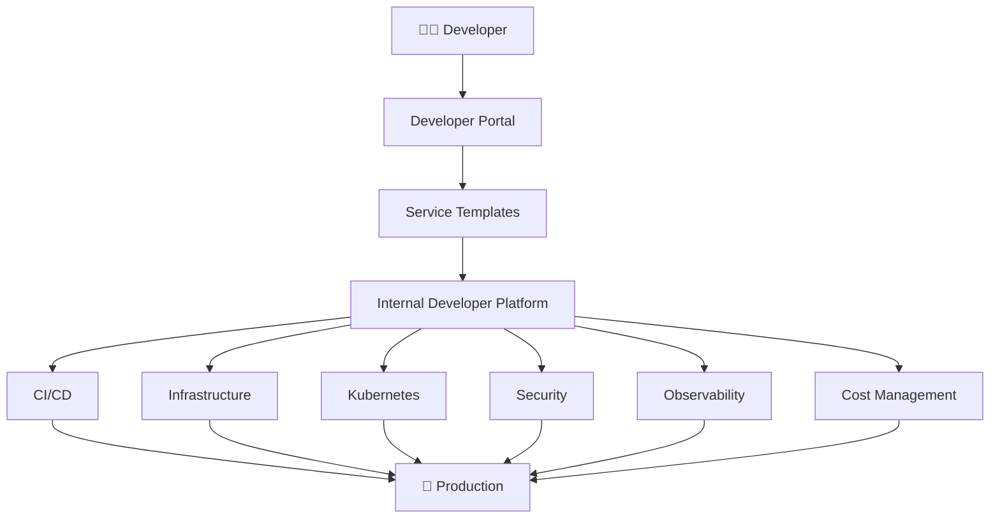

</div>

### Platform Engineering Objective

> **Give developers a paved road from code to production without requiring them to become infrastructure experts.**

---

# ⚙️ My DevOps Lifecycle

<div align="center">

**PLAN** → **CODE** → **BUILD** → **TEST** → **SECURE** → **PACKAGE** → **DEPLOY** → **OBSERVE** → **OPTIMIZE** → ♻️

</div>

---

# 🌐 Engineering Interests

<table>
<tr>
<td>☁️ Cloud Architecture</td>
<td>☸️ Kubernetes Platform Engineering</td>
<td>🚀 CI/CD Architecture</td>
</tr>
<tr>
<td>🏗️ Infrastructure as Code</td>
<td>🔐 DevSecOps</td>
<td>📊 Observability</td>
</tr>
<tr>
<td>📈 Autoscaling</td>
<td>🐳 Container Platforms</td>
<td>⚙️ Infrastructure Automation</td>
</tr>
<tr>
<td>💰 Cloud Cost Optimization</td>
<td>🔄 GitOps</td>
<td>🧩 Internal Developer Platforms</td>
</tr>
<tr>
<td>🛡️ Reliability Engineering</td>
<td colspan="2"></td>
</tr>
</table>

---

# 📚 Continuous Learning

Technology changes quickly.

<div align="center">

**Learn** → **Build** → **Break** → **Troubleshoot** → **Understand** → **Automate** → **Document** → **Repeat**

</div>

I prefer **hands-on experimentation over simply reading documentation**.

---

# 🤝 Let's Connect

I'm interested in conversations around:

**AWS · Kubernetes · DevOps · CI/CD · Terraform · Jenkins · Docker · Platform Engineering · Observability · Cloud Architecture**

<div align="center">

<a href="https://github.com/ramdrazler1">
  
</a>

</div>

---

# ⚡ Engineering Motto

<div align="center">

### `AUTOMATE EVERYTHING THAT SHOULD BE AUTOMATED.`

### `OBSERVE EVERYTHING THAT MATTERS.`

### `DESIGN FOR FAILURE.`

### `KEEP IMPROVING.`

<br/>

**🚀 Build → Automate → Secure → Deploy → Observe → Improve**

<br/><br/>


<br/><br/>

<i>Infrastructure is code. Delivery is automation. Reliability is a feature.</i>

</div>
